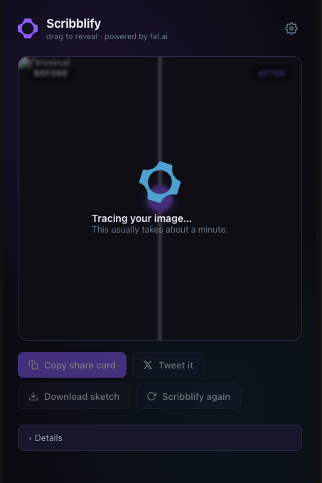

# Scribblify — Sketch any image

A Chrome extension that turns any image on the web into a sketch with one
right-click. Powered by [fal.ai](https://fal.ai).

> Right-click → **Scribblify this image** → drag the slider to reveal
> the before/after → **Copy share card** to paste anywhere.

## Screenshot



## What it does

1. Adds a context-menu item on every image: **Scribblify this image**.
2. Sends the image URL to a fixed fal.ai workflow
   (`workflows/abdul-7gw2467hshf7/gpt-image-2-sketch`).
3. Opens a result tab with a drag-to-wipe before/after viewer.
4. Generates a 1200×630 share card with both images side-by-side, ready
   to paste into Twitter / Slack / Discord.

## Install (unpacked)

1. Clone or download this repo.
2. Open `chrome://extensions` in Chrome.
3. Toggle **Developer mode** on (top right).
4. Click **Load unpacked** and select this folder.
5. Click the Scribblify toolbar icon (the purple petal mark) → paste your
   fal.ai API key → **Save**.

Get an API key at https://fal.ai/dashboard/keys. It's stored only in
`chrome.storage.local` on your machine — it never leaves your browser
except in the `Authorization` header sent to `queue.fal.run`.

## Use

1. Right-click any image on a web page.
2. Choose **Scribblify this image** from the context menu.
3. A new tab opens with the fal-color spinner while the workflow runs
   (usually about a minute).
4. When the sketch lands it wipes in over the original. Drag the handle
   to compare.
5. **Copy share card** → side-by-side PNG goes to your clipboard.
   **Download sketch** → just the raw sketch.

## How it works

The extension calls the fal.ai **queue REST API** directly
(`POST https://queue.fal.run/<workflow>`, then polls `status_url` until
`COMPLETED`, then `GET response_url`). No build step, no bundler, no
dependency on `@fal-ai/client`. Everything is plain JS that runs in the
extension's service worker and result page.

## Permissions

The manifest requests:

| Permission       | Why                                                      |
|------------------|----------------------------------------------------------|
| `contextMenus`   | Add the right-click "Scribblify this image" item.             |
| `storage`        | Save your fal.ai API key in `chrome.storage.local`.      |
| `tabs`           | Open the result page in a new tab next to the source.    |
| `host_permissions: queue.fal.run, fal.media, ...` | Submit jobs and load result images. |
| `host_permissions: <all_urls>` | Read the right-clicked image URL across all sites. |

The extension makes **no network calls** other than to fal.ai (and to
the source image URL the browser was already going to load anyway).

## Project structure

```
fal-sketch-extension/
├── manifest.json       # MV3 manifest
├── background.js       # service worker — registers context menu
├── options.html/.js    # API-key settings popup
├── result.html/.js     # before/after viewer + share card
├── icons/              # 16/48/128 PNG icons (the fal mark in purple)
├── LICENSE             # MIT
└── README.md
```

## Troubleshooting

- **"No fal.ai API key set"** — click the Scribblify toolbar icon and paste
  your key.
- **Share card fails to copy / `CORS`** — some hosts (e.g. some CDNs)
  block cross-origin reads of their images. The sketch result itself
  always works because fal serves it with permissive CORS; the
  *original* image is the one that can fail. Use **Download sketch**
  instead.
- **The job is queued forever** — check your fal.ai dashboard for
  account credits / rate limits.
- **Right-click menu missing** — Chrome only shows it on ``
  elements. Some sites use CSS `background-image`; those aren't
  supported.

## Security

- The API key is read **only** by the result page after a legitimate
  right-click. The result page is gated by an unguessable single-use
  token (`crypto.randomUUID()`) written to `chrome.storage.session` by
  the background service worker. A malicious web page cannot forge a
  token, so it cannot trigger fal.ai requests against your key.
- `result.html` is **not** in `web_accessible_resources` — only the
  extension itself can open it.
- All API calls go directly to `queue.fal.run` over HTTPS. No
  third-party telemetry, no analytics, no remote code.

## Disclaimer

- The sketch transformation is performed by a public fal.ai workflow.
  This extension does not own or maintain that workflow.
- This project is **not affiliated with fal.ai**.

## Credits

- Prompt inspiration shared by [@arrakis_ai](https://x.com/arrakis_ai/status/2049689793118998717).

## License

MIT — see [LICENSE](LICENSE).
